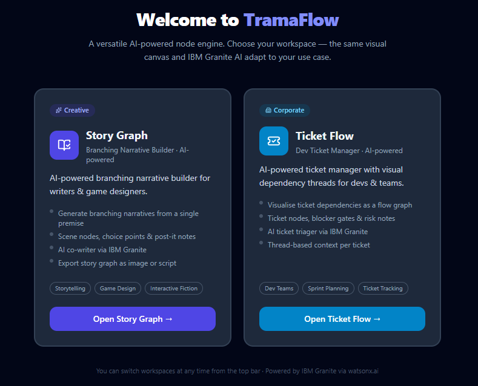
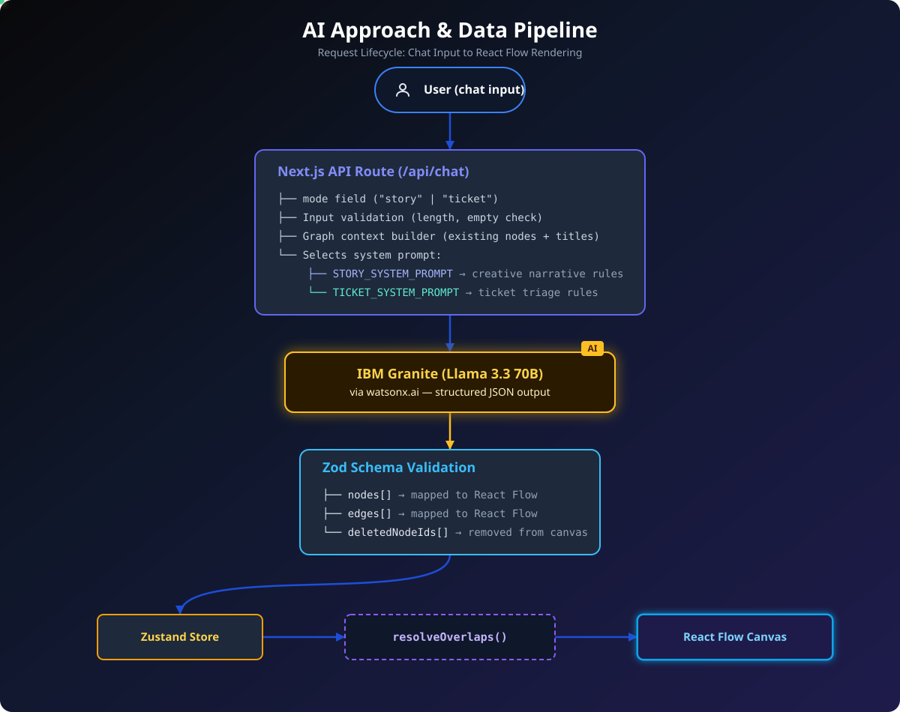

<div align="center">


<br/>

[](https://nextjs.org/)
[](https://reactflow.dev/)
[](https://www.typescriptlang.org/)
[](https://www.ibm.com/watsonx)
[](https://js.langchain.com/)
[](https://tailwindcss.com/)
[](https://zustand-demo.pmnd.rs/)
[](https://zod.dev/)

<br/>

**A versatile AI-powered node engine with two workspace modes.**
<br/>
One canvas. One AI. Two completely different use cases — creative storytelling and corporate ticket management.

> **IBM AI Builders Challenge — July 2026 | Creative Industries Theme**

</div>

---

### DEMO

https://youtu.be/QfLtGRkLX-0

## Problem Statement

Both **writers building interactive narratives** and **developers managing project tickets** face the same fundamental gap: AI tools can generate content, but none let you *see the structure while building it*.

- **Story mode**: Planning a branching narrative requires tracking decisions, consequences, and plot threads across dozens of nodes — slow, error-prone, and creatively limiting.
- **Ticket mode**: Visualising ticket dependencies, blockers, and sprint flows in a way that the AI understands and can actively help manage is still an unsolved problem for most dev teams.

There is no tool that combines AI generation with real-time visual graph editing **across both domains** in a single, integrated workspace.

---

## Solution Description

**TramaFlow** is a dual-mode, AI-powered node engine. At launch, the user chooses a workspace:

<div align="center">
  
</div>

<br/>

### 🎭 Story Graph (Creative Mode)
An AI branching narrative builder with a dual-panel interface:
- **Left panel** — Conversational AI (IBM Granite) that understands natural language: generate scenes, add decision points, delete nodes, and modify the story by describing what you want.
- **Right panel** — Live visual graph (React Flow) where every story beat, choice, and consequence is a node.

Key capabilities:
- Generate complete branching stories from a single premise
- Scene nodes, Choice nodes, and post-it Note nodes
- Automatic collision detection — nodes never overlap
- Copy/paste support for single and multi-node selections
- Export story graph as image or text

<div aling="center">
  
</div>

### 🎫 Ticket Flow (Corporate Mode)
A visual ticket dependency manager for dev teams and project leads:
- **Left panel** — AI ticket triager (IBM Granite) that creates tickets, maps dependencies, and updates priorities via chat.
- **Right panel** — Visual flow board where tickets, blockers, and notes form a dependency graph.

Key capabilities:
- Generate a full sprint board from a feature description
- Ticket nodes (tasks/stories/bugs), Blocker nodes (decision gates), and Note nodes (risk observations)
- AI-assigned labels: `feature | bug | chore | spike` + `critical | high | medium | low` + `open | in-progress | blocked | done`
- Same dependency threading and collision resolution as Story mode

### Shared engine
Both modes run on the **exact same React Flow canvas and Zustand store**. Switching workspaces is a single button click — the canvas resets and the AI receives a completely different System Prompt.

---

## Selected Challenge Theme

**Storytelling and content creation tools** — specifically, AI-powered interactive narrative design for game developers, screenwriters, and interactive fiction authors. The Ticket Flow mode extends this into creative production workflows where teams need to track the *making* of creative work.

---

## AI Approach & Architecture

<div align="center">
  
</div>

<br/>

```
User (chat input)
        │
        ▼
Next.js API Route  /api/chat
  ├── mode field  ("story" | "ticket")
  ├── Input validation (length, empty check)
  ├── Graph context builder (existing nodes + titles sent as context)
  └── Selects system prompt
        ├── STORY_SYSTEM_PROMPT  → creative narrative rules
        └── TICKET_SYSTEM_PROMPT → ticket triage & dependency rules
              │
              ▼
        IBM Granite (meta-llama/llama-3-3-70b-instruct)
        via watsonx.ai — structured JSON output
              │
              ▼
     Zod schema validation
     ├── nodes[]   → mapped to React Flow nodes
     ├── edges[]   → mapped to React Flow edges
     └── deletedNodeIds[] → removed from canvas
              │
              ▼
   Zustand store → resolveOverlaps() → React Flow canvas
```

**Models & services used:**
- IBM Granite / Llama 3.3 70B (`meta-llama/llama-3-3-70b-instruct`) via watsonx.ai
- Direct watsonx.ai REST API (IAM token–based, 1-hour cache)
- Zod for response schema validation and type safety

**Key AI design decisions:**
- Two isolated system prompts selected at request time based on `mode` — zero prompt bleed between modes
- `existingNodeContext` injected on every request so the AI knows the live canvas state
- Server-side cap of 10 new nodes per response prevents runaway generation
- Structured output (not free-form) ensures the LLM always returns valid graph mutations

---

## Workspace Architecture


```
src/
├── types/
│   ├── story.ts          # React Flow node/edge/chat types (shared)
│   └── workspace.ts      # WorkspaceConfig type + STORY_CONFIG + TICKET_CONFIG
├── lib/
│   └── systemPrompts.ts  # STORY_SYSTEM_PROMPT  + TICKET_SYSTEM_PROMPT
├── store/
│   └── useStoryStore.ts  # Zustand store — workspaceMode: "story" | "ticket" | null
├── app/
│   ├── page.tsx          # Mode gate: null → WorkspaceSelector, else → full app
│   └── api/chat/
│       └── route.ts      # Selects prompt by mode, calls watsonx, validates with Zod
└── components/
    ├── workspace/
    │   └── WorkspaceSelector.tsx   # Landing page — mode picker cards
    ├── canvas/
    │   └── FlowCanvas.tsx          # Mode-aware toolbar (Scene/Ticket, Choice/Blocker)
    ├── chat/
    │   └── ChatPanel.tsx           # Mode-aware labels, suggestions, placeholder
    └── nodes/
        ├── StoryNode.tsx           # Renders as Scene (indigo) or Ticket (sky)
        ├── ChoiceNode.tsx          # Renders as Choice (violet) or Blocker (teal)
        └── NoteNode.tsx            # Unchanged — amber post-it in both modes
```

**Adding a new workspace mode** requires only:
1. A new `WorkspaceConfig` entry in `workspace.ts`
2. A new system prompt string in `systemPrompts.ts`
3. A new `WorkspaceMode` union member

No changes to the canvas, store, or API route are needed.

---

## How IBM Bob Was Used

IBM Bob was the **primary development tool** throughout this project. Specific uses:

1. **Architecture planning** — Bob generated the initial project structure, the LangChain integration approach, and the dual-mode workspace architecture from high-level descriptions.
2. **Workspace mode system** — Bob designed and implemented the `WorkspaceConfig` type, the `WorkspaceSelector` landing component, and the mode-switching flow in Zustand.
3. **Dual system prompt design** — Bob authored both `STORY_SYSTEM_PROMPT` and `TICKET_SYSTEM_PROMPT` with the precise React Flow handle rules, tag taxonomies, and output format constraints.
4. **LangChain + watsonx integration** — Bob wrote the direct watsonx REST API integration, the Zod schema for structured output, and the IAM token cache.
5. **Bug diagnosis and fixes** — Bob identified and fixed three critical bugs: choice edge connection failures (sourceHandle ID mismatch), delete not resolving node titles to IDs, and runaway node generation (94 nodes from one prompt).
6. **Feature implementation** — Bob implemented collision detection (`resolveOverlaps`), copy/paste with click-to-place, per-mode color palettes for all node types, and the paste mode overlay.
7. **Security hardening** — Bob added input length validation, request timeout (45 s), error message classification, and the `/api/health` diagnostic endpoint.

---

## Running Locally

### Prerequisites
- Node.js 18+
- An [IBM Cloud account](https://cloud.ibm.com) with watsonx.ai access
- A watsonx.ai project with at least one model enabled

### Setup

```bash
git clone https://github.com/[your-username]/tramaflow
cd tramaflow/story-editor
npm install
```

Create `.env.local` in the project root (`story-editor/`):

```env
WATSONX_API_KEY=your_ibm_cloud_api_key
WATSONX_PROJECT_ID=your_watsonx_project_id
WATSONX_URL=https://us-south.ml.cloud.ibm.com
WATSONX_MODEL=meta-llama/llama-3-3-70b-instruct
```

```bash
npm run dev
# Open http://localhost:3000
# Verify connection: http://localhost:3000/api/health
```

### Getting your watsonx credentials
1. **API Key** → [cloud.ibm.com](https://cloud.ibm.com) → Manage → Access → API keys → Create
2. **Project ID** → [dataplatform.cloud.ibm.com](https://dataplatform.cloud.ibm.com) → Your project → Manage → General → Project ID

---

## Tech Stack

<div align="center">
  <table width="100%">
    <thead>
      <tr>
        <th width="22%" align="left">Layer</th>
        <th width="28%" align="left">Technology</th>
        <th width="50%" align="left">Notes</th>
      </tr>
    </thead>
    <tbody>
      <tr>
        <td><strong>Framework</strong></td>
        <td><b>Next.js 14</b> <sub>(App Router)</sub></td>
        <td>SSR disabled for React Flow to ensure pure client-side rendering.</td>
      </tr>
      <tr>
        <td><strong>Graph Canvas</strong></td>
        <td><b>React Flow 11</b></td>
        <td>Shared architecture across both <code>Story</code> and <code>Ticket</code> modes.</td>
      </tr>
      <tr>
        <td><strong>State Management</strong></td>
        <td><b>Zustand</b></td>
        <td>The <code>workspaceMode</code> state seamlessly drives all UI context changes.</td>
      </tr>
      <tr>
        <td><strong>AI Model</strong></td>
        <td><b>IBM Granite</b><br/><sub>(Llama 3.3 70B)</sub></td>
        <td>Accessed directly via watsonx.ai REST API for robust generation.</td>
      </tr>
      <tr>
        <td><strong>AI Platform</strong></td>
        <td><b>IBM watsonx.ai</b></td>
        <td>Secured with IAM token auth and optimized with a 1-hour cache.</td>
      </tr>
      <tr>
        <td><strong>LLM Framework</strong></td>
        <td><b>LangChain</b><br/><sub><code>@langchain/ibm</code></sub></td>
        <td>Handles complex structured JSON outputs and prompt chaining.</td>
      </tr>
      <tr>
        <td><strong>Schema Validation</strong></td>
        <td><b>Zod</b></td>
        <td>Guarantees the LLM always returns strictly valid graph mutations.</td>
      </tr>
      <tr>
        <td><strong>Styling</strong></td>
        <td><b>Tailwind CSS</b></td>
        <td>Dynamic per-mode accent palettes (indigo/violet vs sky/teal).</td>
      </tr>
      <tr>
        <td><strong>Language</strong></td>
        <td><b>TypeScript 5</b></td>
        <td>Strict mode enforced, ensuring zero <code>any</code> types in core files.</td>
      </tr>
    </tbody>
  </table>
</div>
---

<br/>

<div align="center">
  
</div>
